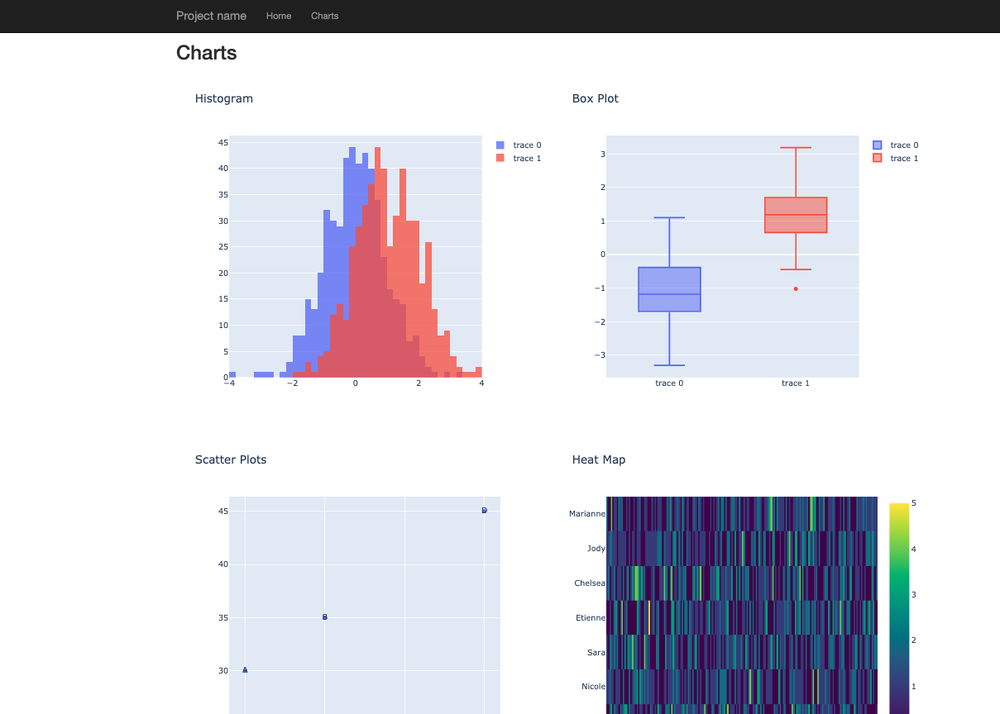

##### [Replace the contents this README.MD file with the appropriate "Users manual" needed for the project]  
  
   
   
# Web Content - Django Template

## Introduction

> This page gives details concerning guiding principles and skeleton template required for developing Django web application. 

## Requirements
- #### Git and Github accounts
    Follow this installation guide [HERE](https://git-scm.com/book/en/v2/Getting-Started-Installing-Git) to install Git in your local machine. Additionally, direct to Github [sign up](https://github.com/join?source=header-home) page if you do not have the account. 
- #### Python(version>2.7 or >3.0)
- ```
    pip install django
    ```
- ```
    pip install pipenv
    ```

     
## Installation

> Getting started with the Django Template: 
- To create a new Django project (make sure to change `project_name`)
    ```
    django-admin.py startproject --template=https://github.com/biobakery/django-web-template/archive/master.zip --extension=py,md,html,txt project_name
    ```
- cd to your project and install the development dependences
    ```
    pipenv install --dev
    ```
- If you need a database, edit the settings and create one with:
    ```
    pipenv run python manage.py migrate
    ```
- Once everything it's setup you can run the development server: [http://localhost:8000/](http://localhost:8000/)
    ```
    pipenv run python manage.py runserver
    ```

Browser Demo :
